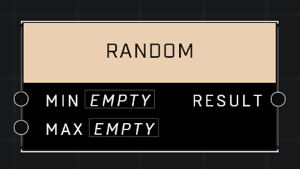

# Random

## Description
Returns a random, uniformly-distrubuted float value between the Min and Max. Use Round to Whole Number on the output to generate a random integer.

## Node Type
Nodes fall into two basic categories: Data and Execution. This node supplies Data for an Execution node.

## Inputs
| Input | Type | Required | Description |
|------------------|------------------|----------|--------------------------------------------------------------|
| Min | Number | Yes | Minumum number the random number can be. |
| Max | Number | Yes | Maximum number the random number can be. |

## Outputs
| Output | Type | Description |
|------------------|------------------|--------------------------------------------------------------|
| Result | Number | The resulting random number. |

****
## Learn More About This Node

When working with the Random node, it is important to keep in mind the following:

* Every node that the Random node is connected to will pull a new random number during execution.
* This means that plugging Random into multiple nodes may result in each node receiving a different number.
* To maintain a consistent random number, create a local variable and set the value of that variable when the script initially executes. Then, refer to that variable for the remainder of the script's execution.

Additionally, despite what Random's description may lead you to believe, Random actually returns a whole number between the Min and Max values provided, inclusively. This means that the Min and Max values provided are valid random numbers that may be returned by the node. For example, a Min and Max of 0 and 1 may return either 0 or 1.

\
\
**Contributors**

Captain Punch\
AgentZero\
AddiCt3d 2CHa0s

